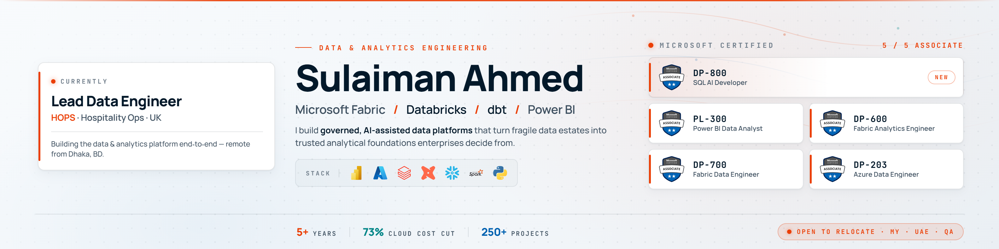

<p align="center">
  
</p>

# Sulaiman Ahmed

**Lead Data Engineer @ HOPS | 5x Microsoft Certified | Building AI-Powered Data Tools**

[](https://linkedin.com/in/sulaimanahmed)
[](https://sulaiman-ahmed.lovable.app)
[](https://www.youtube.com/@sulaimanahmed013)
[](mailto:sulaimanahmed013@gmail.com)

---

## About

**Lead Data Engineer at HOPS** — a UK hospitality-operations company — with **5+ years of experience** transforming raw data into governed, AI-assisted analytics platforms. I build tools that democratize data access, enabling natural language interaction with enterprise data platforms.

Currently focused on Analytics Engineering along with **Model Context Protocol (MCP) servers** that bridge AI assistants with business intelligence tools like Power BI and Microsoft Fabric.

**Dhaka, Bangladesh** | Open to opportunities in **UAE, Saudi Arabia & USA**

---

## What I'm Building Now

> My 5 most recently updated public repositories — a live look at what I'm working on right now.

| Project | What it is | Stars |
|---------|------------|-------|
| [**PowerBIStaticRLSMagic**](https://github.com/sulaiman013/PowerBIStaticRLSMagic) | App-owns-data Power BI embedding with static RLS: one embedded report, each viewer sees only their own slice — no per-user Power BI licenses. |  |
| [**CodeFirstPowerBI**](https://github.com/sulaiman013/CodeFirstPowerBI) | Code-first Power BI report design: from an Excalidraw sketch to a production report, with a coding agent authoring the canvas, visuals & model. |  |
| [**powerbi-mcp**](https://github.com/sulaiman013/powerbi-mcp) | MCP server for natural-language interaction with Power BI datasets — Desktop & Cloud via XMLA. |  |
| [**Superstore_FabricApp**](https://github.com/sulaiman013/Superstore_FabricApp) | Two-app Microsoft Fabric translytical demo: an operational self-checkout that *writes* sales, and a Direct Lake dashboard that *reads* them back near real time. |  |
| [**MS-Rayfin-and-Fabric-R-D**](https://github.com/sulaiman013/MS-Rayfin-and-Fabric-R-D) | R&D POC of the Rayfin + Microsoft Fabric translytical loop: an app captures sales-pipeline data, Fabric auto-mirrors it to OneLake, and a Direct Lake Power BI report serves funnel analytics — built CLI-only with `fab` + `pbir`. |  |

<p align="center">
  <a href="https://github.com/sulaiman013?tab=repositories&sort=pushed">
    
  </a>
</p>

---

## Tech Stack

**Analytics & BI**
```
Power BI (DAX, XMLA, TMDL) • Microsoft Fabric • Databricks • dbt • Tableau
```

**Databases & Warehousing**
```
SQL Server (T-SQL) • Snowflake • MySQL • Medallion Architecture
```

**Programming**
```
Python • PySpark • SQL • R
```

**Cloud & Ops**
```
Microsoft Azure • Azure Data Factory • Azure DevOps (CI/CD) • Fivetran • Git
```

---

## Certifications


| Certification | Focus |
|--------------|-------|
| Power BI Data Analyst Associate | Dashboard development, DAX, data modeling |
| Fabric Analytics Engineer Associate | End-to-end analytics in Microsoft Fabric |
| Fabric Data Engineer Associate | Data pipelines, lakehouses, warehouses |
| Azure Data Engineer Associate | Azure data services, ETL, data storage |
| SQL AI Developer Associate | Vector search, embeddings & RAG-enabled database solutions (DP-800) |

---

## Experience

| Role | Company | Period |
|------|---------|--------|
| Lead Data Engineer | HOPS — Hospitality Operations (UK) | May 2026 - Present |
| Analytics Engineer | Data Crafters | Nov 2024 - May 2026 |
| Data Engineer | Insightin Technology Ltd. | Jan 2024 - Oct 2024 |
| Data Engineer | SJ Analytics | Nov 2020 - Dec 2023 |

---

## Education

**BSc. in Statistics** — Shahjalal University of Science and Technology, Sylhet
CGPA: 3.55 | 2017 - 2021

**Research:** 70+ citations on COVID-19 research publications

---

## GitHub Stats

<div align="center">

  <a href="https://github.com/brunobritodev/awesome-github-stats">
    
  </a>

  <br />
  <br />

  
  
  
  

</div>

---

## Let's Connect

Building tools at the intersection of **AI and Business Intelligence**. Interested in how LLMs can make enterprise data accessible to everyone.

Open to collaboration on data analytics and AI-powered BI projects.

[](https://linkedin.com/in/sulaimanahmed)
